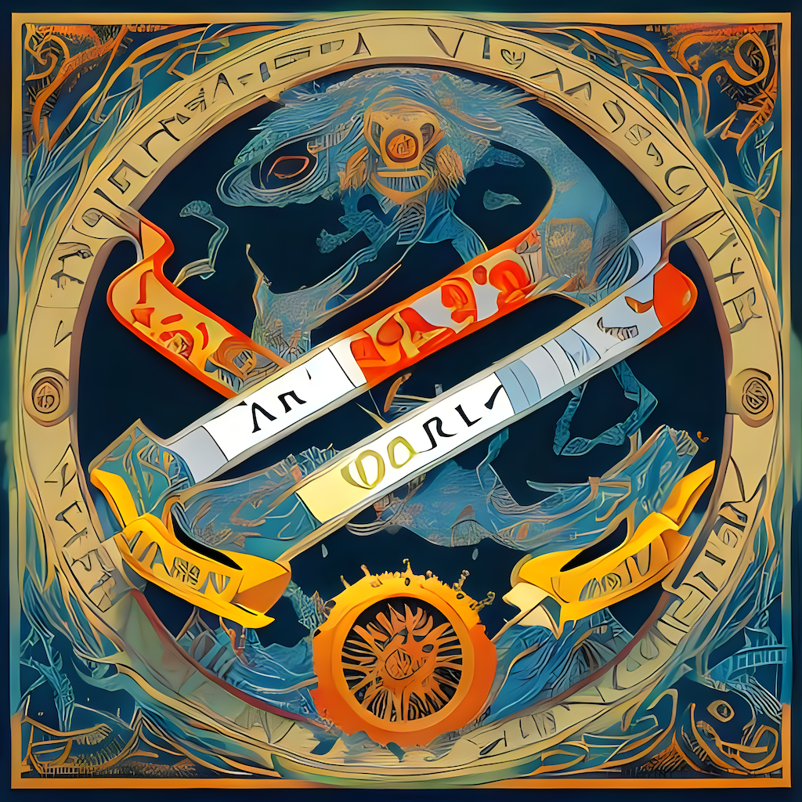

# Home

**Lazarus NLP** is a collective initiative to revive the dying languages of Indonesia through speech and language technology.

<figure markdown>
  { width=400; }
  <figcaption>Revival of Languages, via <a href="https://huggingface.co/prompthero/openjourney">OpenJourney</a></figcaption>
</figure>

Particularly, we plan to apply the following technologies on languages of Indonesia:

- Neural Machine Translation
- Automatic Speech Recognition
- Text-to-Speech
- Speech-to-Speech Translation

For starters, you can read why this project was launched in the following sections.

## Languages of Indonesia

Although the Indonesian language (_Bahasa Indonesia_) is the country's national language and lingua franca, the Indonesian people continue to use their region's native/indigenous language on a daily basis.

The nation is home to over 700 distinct languages, each with its own characteristics and origins. Some languages share similarities, but each language continues to evolve in its own ways over time and in the regions where the language is predominantly spoken.

Wikipedia[^1] gives a very nice overview of the spread and usage of several regional languages:

| Language        | Number (millions) | % of total population | Branch             | Main areas where spoken                                                        |
| --------------- | ----------------- | --------------------- | ------------------ | ------------------------------------------------------------------------------ |
| Javanese        | 84.3              | 32.28                 | Javanese           | throughout Java Island and several provinces in Sumatra and Kalimantan island. |
| Sundanese       | 42.0              | 16.08                 | Sundanese          | West Java, Banten, Jakarta                                                     |
| Madurese        | 13.6              | 5.21                  | Madurese           | Madura Island (East Java)                                                      |
| Minangkabau     | 5.5               | 2.11                  | Malayic            | West Sumatra, Riau, Jambi, Bengkulu, Jakarta                                   |
| Buginese        | 5.0               | 1.91                  | South Sulawesi     | South Sulawesi                                                                 |
| Palembang Malay | 3.9               | 1.49                  | Malayic            | South Sumatra                                                                  |
| Banjarese       | 3.5               | 1.34                  | Malayic            | South Kalimantan, East Kalimantan, Central Kalimantan                          |
| Acehnese        | 3.5               | 1.34                  | Chamic             | Aceh                                                                           |
| Balinese        | 3.3               | 1.26                  | Bali-Sasak-Sumbawa | Bali Island and Lombok Island                                                  |
| Betawi          | 2.7               | 1.03                  | Malay-based creole | Jakarta                                                                        |

## Tech 🤝 Languages

What is deeply concerning about these languages is that, although they may have millions of active speakers, they might still be prone to becoming endangered[^2]. Furthermore, UNESCO classified ^^137 languages^^ in Indonesia as either vulnerable, definitely endangered, severely endangered, or critically endangered[^3].

Despite the richness and diversity of these regional languages, there has very been minimal progress in the application of modern technologies to the many languages of Indonesia. It is only in recent years (~2020) that advancements began to appear, starting with the Indonesian language.

Through this project, we hope to see the same successes occur in other languages of Indonesia. In the long run, we also hope that through these technological advancements, we will be able to prevent these languages from becoming endangered and in turn, spark innovative work around these languages.

[^1]: Wikipedia contributors. (2022, May 20). Languages of Indonesia. In Wikipedia, The Free Encyclopedia. Retrieved 07:55, May 21, 2022, from [https://en.wikipedia.org/w/index.php?title=Languages_of_Indonesia&oldid=1088838885](https://en.wikipedia.org/w/index.php?title=Languages_of_Indonesia&oldid=1088838885).
[^2]: Abtahian, Maya & Cohn, Abigail. (2014). Can a language with millions of speakers be endangered?. Journal of the Southeast Asian Linguistics Society. 7. 64-75.
[^3]: Moseley, Christopher, ed. (2010). Atlas of the World’s Languages in Danger. Memory of Peoples (3rd ed.). Paris: UNESCO Publishing. ISBN 978-92-3-104096-2.
